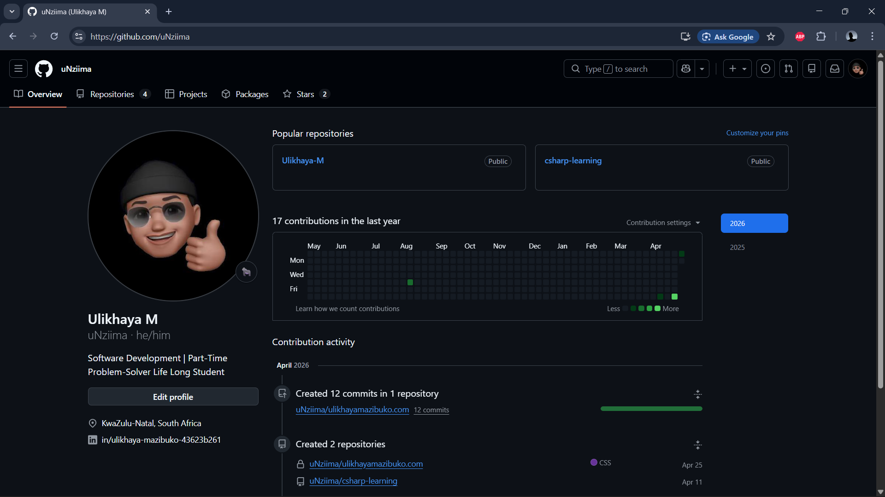

# ulikhayamazibuko.com

The live portfolio and client site of **Ulikhaya Mazibuko**, a web developer and systems builder based in Newcastle, KwaZulu-Natal, South Africa.

**Live site:** [ulikhayamazibuko.com](https://ulikhayamazibuko.com)



## What it is

A fast, mobile-first website for South African small businesses. It explains my services, shows real project work, and helps visitors work out what they need before they get in touch.

It is built by hand with no framework and no build step, so every line of HTML, CSS and JavaScript is deliberate.

## Features

| Feature | What it does | File |
|---|---|---|
| **Digital Business Health Check** | A 10-question self-assessment across 4 categories. Weighted scoring produces a specific recommendation for the business | `health-check.html`, `js/health-check.js` |
| **Package Finder** | A 3-question modal quiz that matches a visitor to the right service package | `js/package-finder.js` |
| **Interactive architecture map** | Click a node (website, automation, data and so on) to see what it does and what it is built with | `js/architecture.js` |
| **Business Clarity demo** | A sample dashboard showing the kind of reporting a client receives | `business-clarity-demo.html` |
| **Portfolio case studies** | Each project is written up as problem, approach and outcome | `portfolio.html` |
| **Video lightbox** | Accessible modal video player, reusable on any element with a `data-video` attribute | `js/video-lightbox.js` |

## Quality and accessibility

The site went through a structured audit, and the fixes are in the commit history. The audit covered:

- Visible keyboard focus states (`:focus-visible`) across all interactive elements
- Colour contrast corrected on light surfaces
- Mobile menu rebuilt around a single `aria-expanded` handler, with Escape to close and focus returned to the trigger
- Duplicate and conflicting CSS definitions consolidated
- Test analytics events removed so only real visitor data is recorded
- Broken asset paths and stray markup fixed

## Tech stack

- HTML, CSS and vanilla JavaScript
- CSS split into a design-token file (`variables.css`), a reset, global styles and one stylesheet per page
- Google Analytics 4 for visitor analytics
- `sitemap.xml`, `robots.txt` and Open Graph previews for search and sharing
- Hosted on Cloudflare with a custom domain

## Project structure

```
├── index.html                 Home
├── about.html                 About
├── services.html              Services and packages
├── portfolio.html             Case studies
├── health-check.html          Digital Business Health Check
├── business-clarity-demo.html Sample client dashboard
├── 404.html                   Custom not-found page
├── css/                       Design tokens, reset, global and page styles
├── js/                        Interactive components, one module per file
└── images/                    Optimised images and icons
```

## Running it locally

There is nothing to install. Clone the repository and open `index.html` in a browser, or serve the folder with any static server:

```
npx serve .
```

## Status

In production and maintained.

## Contact

- Email: [ulikhayamazibuko@gmail.com](mailto:ulikhayamazibuko@gmail.com)
- LinkedIn: [Ulikhaya Mazibuko](https://www.linkedin.com/in/ulikhaya-mazibuko-43623b261)
- Website: [ulikhayamazibuko.com](https://ulikhayamazibuko.com)

## Licence

MIT. See [LICENSE](LICENSE).
